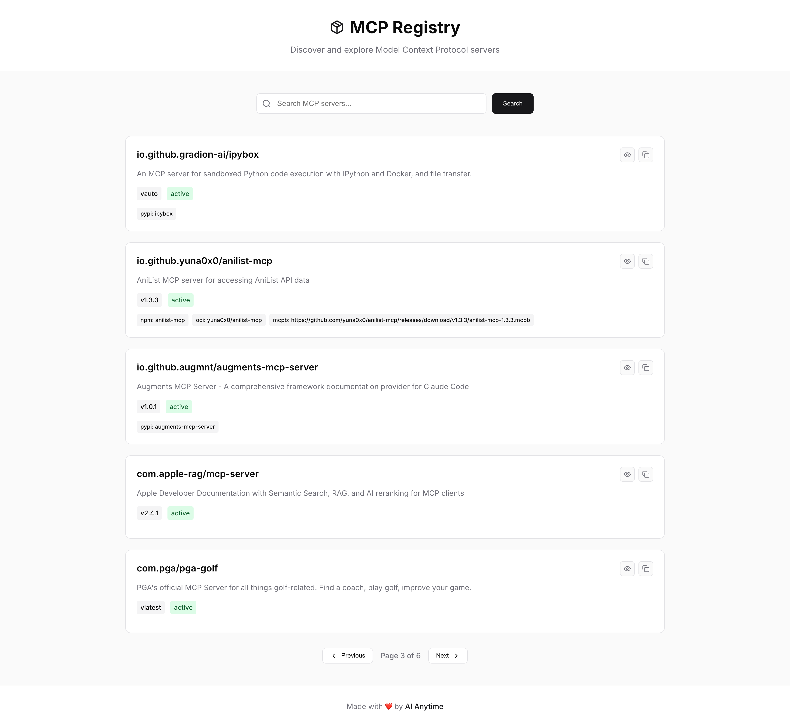

# MCP Registry App

A web application for searching and exploring Model Context Protocol (MCP) servers. Built with FastAPI backend and React frontend.

## Features

- 🔍 **Search MCP Servers** - Search through the official MCP registry
- 📄 **Pagination** - Browse servers 5 at a time with clean pagination
- 📋 **Copy to Clipboard** - Easily copy install commands for npm/pip packages
- 🔗 **External Links** - Quick access to repository URLs
- 📱 **Responsive Design** - Works beautifully on desktop and mobile
- ⚡ **Fast & Modern** - Built with modern web technologies

## Tech Stack

- **Backend**: FastAPI with Python
- **Frontend**: React with Vite
- **Styling**: Modern CSS with Inter font
- **Icons**: Lucide React
- **Package Manager**: uv for Python dependencies
- **Date Handling**: dayjs for relative timestamps

## Screenshots



*Modern, clean interface for browsing MCP servers with detailed modal views*

## Quick Start

### Option 1: Using the shell script (Recommended)
```bash
./start.sh
```

### Option 2: Using Python script
```bash
python3 start.py
```

### Option 3: Using uv directly
```bash
uv run uvicorn backend.main:app --host 0.0.0.0 --port 8000 --reload
```

### Option 4: Manual startup
```bash
# Terminal 1 - Backend
uv run uvicorn backend.main:app --host 0.0.0.0 --port 8000 --reload

# Terminal 2 - Frontend
cd frontend && npm run dev
```

## Access URLs

- **Frontend**: http://localhost:5173
- **Backend API**: http://localhost:8000
- **API Docs**: http://localhost:8000/docs

## Development

### Backend Setup
The backend uses uv for dependency management:
```bash
uv add fastapi uvicorn httpx
```

### Frontend Setup
The frontend is a standard React + Vite application:
```bash
cd frontend
npm install
npm install lucide-react
```

## API Endpoints

- `GET /api/servers` - List servers with pagination and search
- `GET /api/servers/{id}` - Get specific server details
- `GET /api/health` - Health check

## Design

The app features a modern, clean design with:
- Inter font for excellent typography
- Subtle shadows and borders
- Responsive grid layout
- Smooth transitions and hover effects
- Clean color palette with CSS custom properties

---

Made with ❤️ by [Abdul Musawir](https://github.com/Musawir456)
